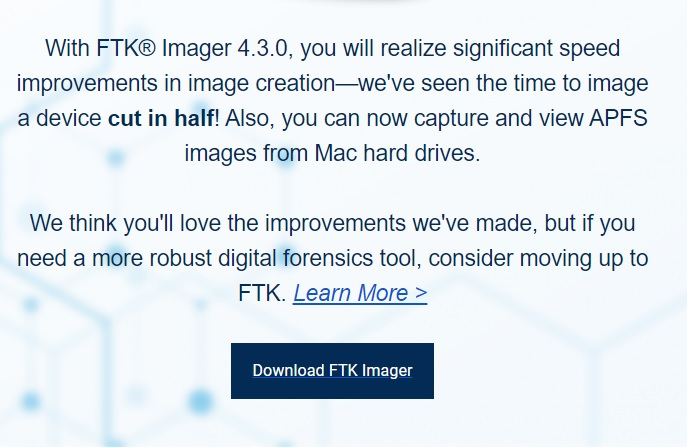
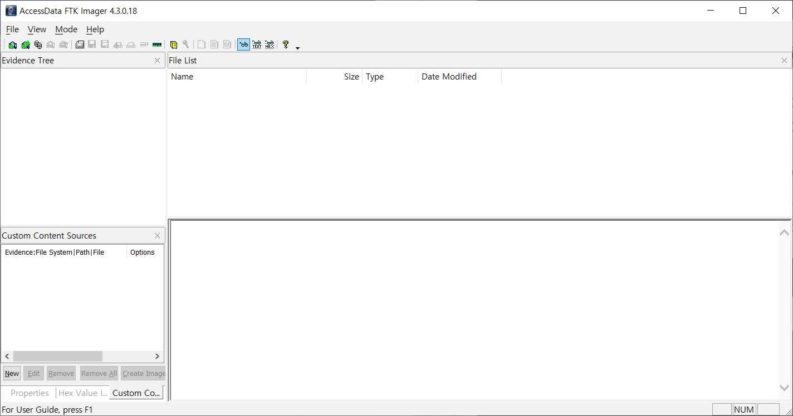

## What is FTK?

FTK란 Forensic Toolkit으로 Access Data사에서 만든 Computer Forensic software이다. 

## What is FTK Imager?

FTK의 구성요소 중 하나로, 증거 수집 기능과 수집된 증거를 확인할 때 용의하게 사용할 수 있는 도구이다. 

다운로드 받는 링크는 아래와 같다.
https://marketing.accessdata.com/l/46432/2020-01-29/8b9ynb 
위의 링크에서 메일주소를 입력하고, 다른 정보를 입력하면 해당 메일로 다운로드 파일을 보내준다. 

위으 그림과 같이 메일이 오는데 "Download FTK Imager"를 클릭하면 다운받을 수 있다. 

실행하면 위와같은 화면이 나온다. 

## Reference

https://whitesnake1004.tistory.com/259
https://en.wikipedia.org/wiki/Forensic_Toolkit

