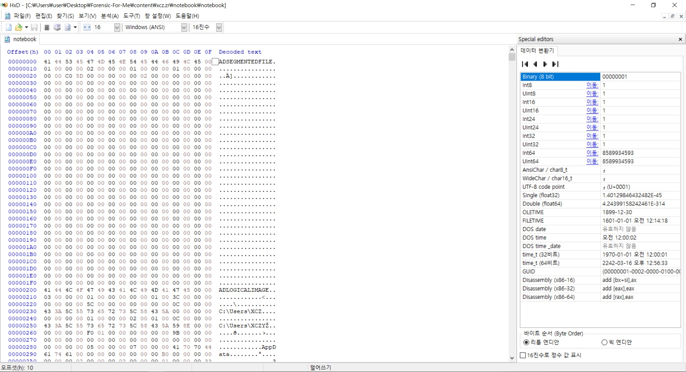
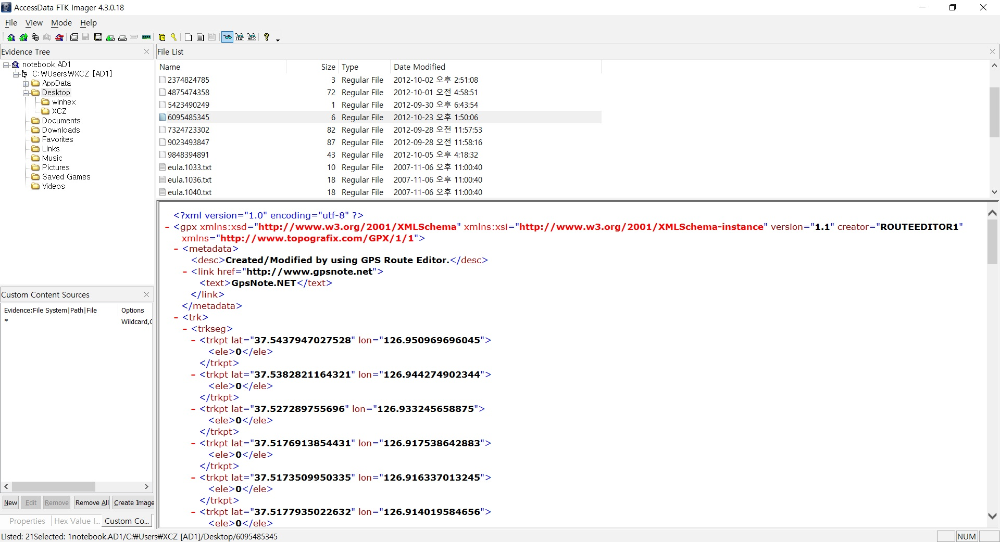
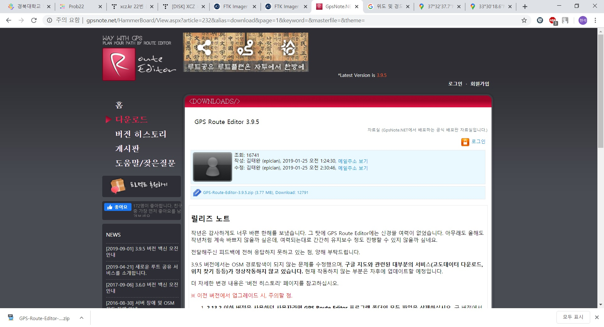
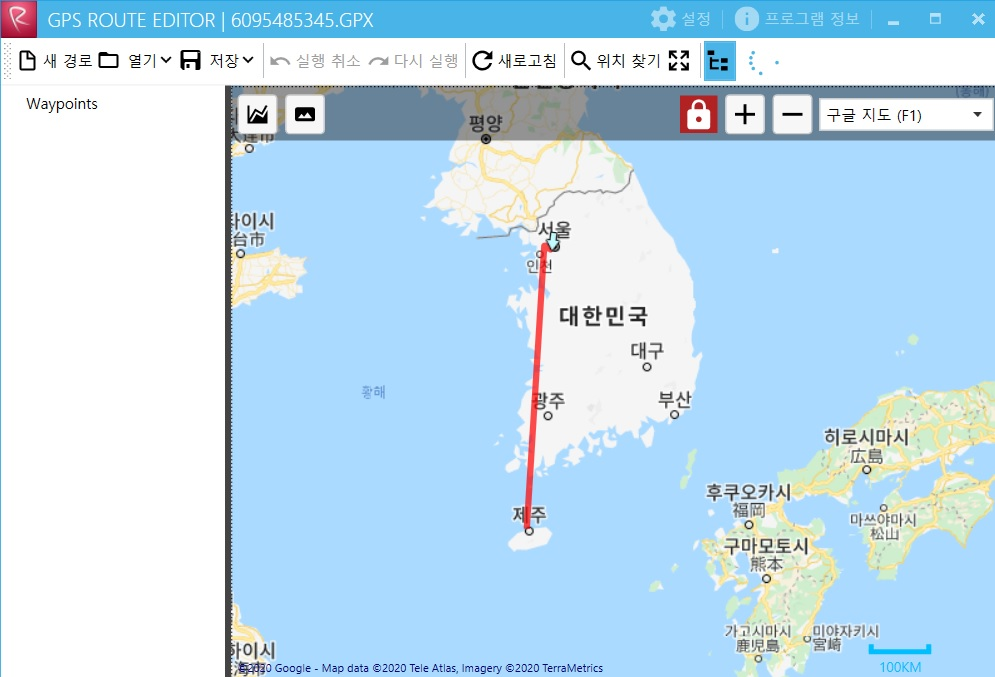
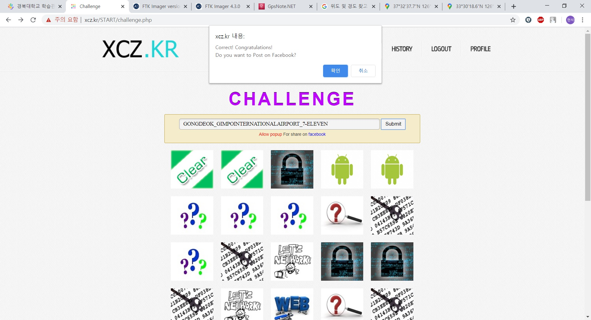

## Description

**Korean**
내친구 A는 어느날 출근길에 누군가 잃어버린 것 같은 노트북을 발견한다.
A는 이 노트북을 주인에게 찾아주고 싶지만 찾을 방법을 몰라서 포렌서인 나에게 노트북을 맡기게된다.
이 노트북의 주인을 찾아주자.

인증키 형식 : 출발지_거쳐가는곳(1곳)_최종도착지
인증키는 모두 대문자로, 띄어쓰기무시
예) PLACE1_PLACE2_PLACE3

**English**
On the way to work one day, my friend found a laptop that someone lost like.
He wanted to give back to the owner laptop.
but, he doesn't know how to know owner.So, he leave laptop to me.

AuthKey : Origin_Stopover(1 Place)_Final Destination
AuthKey is composed of UpperCase and replace space with null
Ex) PLACE1_PLACE2_PLACE3

http://xcz.kr/START/prob/prob_files/notebook <-- Click to download

솔직히 어떻게 해야할지 하나도 모르겠다. 

먼저 HxD 프로그램을 이용해서 파일을 살펴보자. 

AD SEGMENTED FILE 이라는 형식을 발견했다. 이를 의미하는게 무엇인지 찾아보니

Access Data 사에서 만든 파일이라고 한다. 확장자를 AD1으로 하면 파일을 열수 있다고 한다 한번 열어보자. 

Access Data 사에서 제공한 FTK Imager를 이용하여 notebook.AD1 파일을 열어보았다. 

여러가지 파일을 살펴보다가 gps가 적혀있는 파일을 발견했다. 

위쪽의 주소 http://www.gpsnote.net  로 들어가보니 파일이 있어 다운을 받아 보았다. 

해당 파일을 export 하여 확장자를 .gpx로 변경한 후 다운 받은 프로그램에 실행시켰더니 아래와 같은 결과가 나왔다 .

위의 그림을 확대시켜 확인해보면 출발지, 거쳐간 1곳, 도착지를 알 수 있다. 

출발지 : 공덕역

중간 1곳 : 김포 국제 공항

최종 도착지 : 동부렌트카 

위와 같이 하였는데 답이 아니라고 한다...  인터넷에 찾아보니 마지막 부분은 세븐일레븐이라고 하는데 현재는 지도에서 없어진 상태라 볼 수 없다고 한다. 

인증키 : **GONGDEOK_GIMPOINTERNATIONALAIRPORT_7-ELEVEN**

