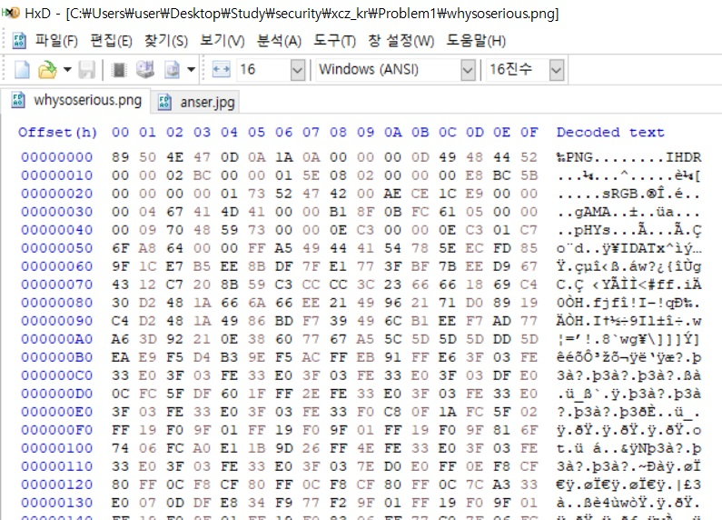
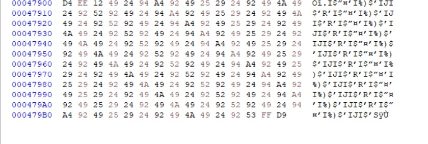
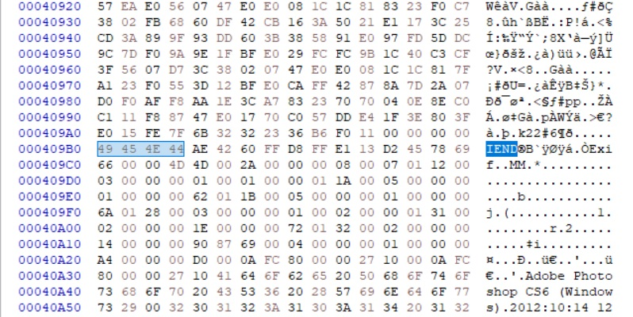

## Title

end of image

## Description

Title을 잘 보면 "end of image" 라고 적혀 있다. 이를 바탕으로 이미지에 숨겨진 무언가가 있다는 것을 유추할 수 있다. 즉, steganography 와 관련된 문제라는 것이다. 먼저 이미지를 다운 받고, HxD를 이용해 이미지를 열어보자. 

Header 부분을 보니 PNG 형태의 그림인 것을 알 수 있다. 이제 제일 아래로 가보자. 

Footer 부분이 0xFF 0XD9로 끝났다. 이는 jpg의 Footer이다. 즉 위의 이미지는 png와 jpg가 합쳐져 있다고 볼 수 있다. 

png의 Footer를 확인해 보니뒤의 0xFF 0xD8이 보인다. 이는 jpg의 header이다. 그럼 우리는 jpg 부분만 따로 잘라서 이미지 파일을 얻어보자. 

위와 같은 파일이 얻어졌다. Auth-key는 JOg-dragonKER이다. 