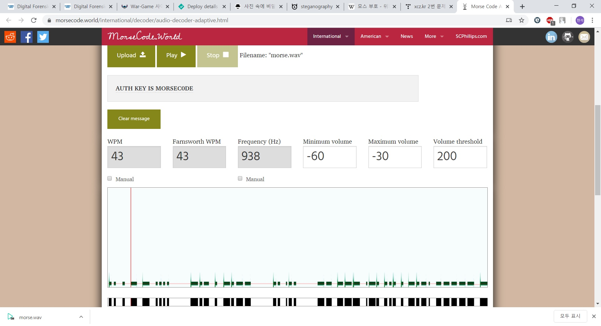

## Title

Listen Carefully!

## Description

Hint1. Auth Key = Upper Case

http://xcz.kr/START/prob/prob_files/morse.wav

2번 문제는 잘 들어보라며 .wav 파일을 제시하였다. 한번 파일을 다운로드 받아 보자. 

이름이 morse.wav 인걸로 보아 모스부호인가 추측해본다. 

Hint가 Upper case라고 했으니, 모스부호로 나오는 값을 대문자로 바꾸면 될 것 같다. 

모스코드를 들으며 해보려 했지만 상당히 어렵다. 그래서 인터넷에 존재하는 tool을 사용하기로 했다. 

https://morsecode.world/international/decoder/audio-decoder-adaptive.html

위의 사이트를 이용하여 morse 부호를 분석했다.

 

AUTH KEY는 MORSEC0DE이다. 